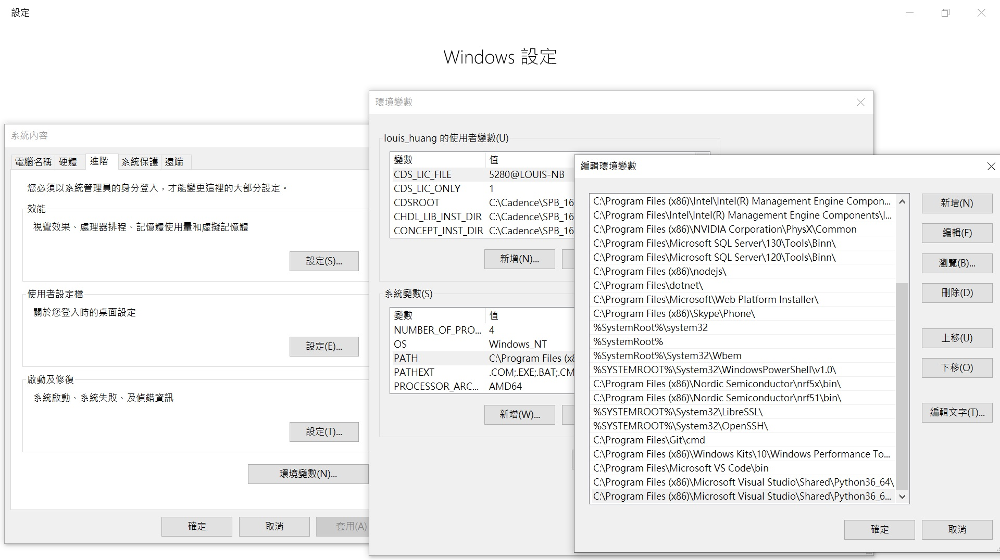

## Python Crawler
爬蟲方法及工具很多,Windows的環境還是方便一些,先抓一些來測試功能及行為,同時記錄一下免得忘了

* 本文參考 http://tw.gitbook.net/python/python_environment.html

### ./Python 及./Python/Scripts 的在Windows的環境變數最好設定在windows系統參數內
* 爬蟲在Windows 10 install Python3.6 運行
* Setup Python path in windows 在命令提示下: C>path %path%;C:\Program Files (x86)\Microsoft Visual Studio\Shared\Python36_64\  或是在系統環境變數path 加入C:\Program Files (x86)\Microsoft Visual Studio\Shared\Python36_64\ 

* Setup PIP path in windows 在命令提示下: C>path %path%;C:\Program Files (x86)\Microsoft Visual Studio\Shared\Python36_64\Scripts  或是在系統環境變數path 加入C:\Program Files (x86)\Microsoft Visual Studio\Shared\Python36_64\Scripts

### 本例debug運行時,注意有些庫文件要預先裝的
* pip install setuptools
* pip install requests
* pip install beautifulsoup4
* pip install bs4
* pip install lxml
* pip install pandas

#### 根據證劵交易TSE的資訊爬出 哪月份之外陸資買賣資訊
Stock_TWT38U.py
* r=requests.get('https://www.twse.com.tw/fund/TWT38U?response=jsonl')
* r=requests.get('https://www.twse.com.tw/fund/TWT38U?response=jsonl&date=20190716', headers=headers)
Other
* request TWT38U? 外陸資買賣資訊
* request TWT43U? 自營商買賣資訊
* request TWT44U? 投信買賣資訊

#### 根據證劵交易TSE的資訊代碼爬出 成交股數	成交金額	開盤價	最高價	最低價	收盤價	漲跌價差	成交筆數
Stock_TWSE.py
* url_twse='http://www.twse.com.tw/exchangeReport/STOCK_DAY?response=json&date='+str(date)+'&stockNo='+str(stock_id)

#### 參考資訊
https://github.com/Asoul/tsec
https://github.com/nelsonchung/TaiwanStockMonitor